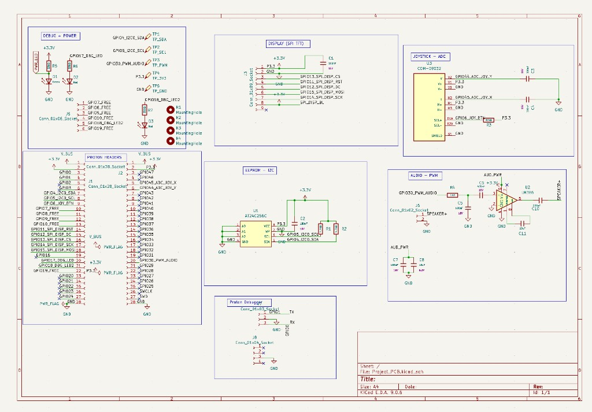
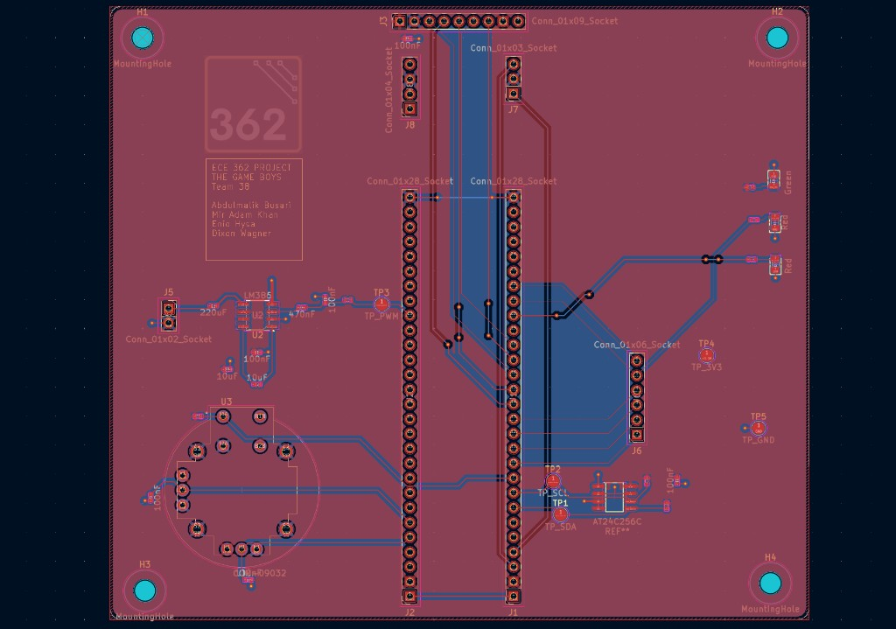

# RP2350 Handheld Game Console

ECE 362 final project firmware and hardware files for a handheld game console built on the RP2350 Proton board.  
The current codebase includes a game-selection menu and three playable games: Tetris, 2048, and Space Invaders.

This README explains how to download the project, build it as-is, flash it, and test the hardware.

## Project Contents

- `src/`: Main firmware source (menu, games, drivers)
- `platformio.ini`: PlatformIO environment and build filter
- `Project_PCB/`: KiCad schematic and PCB files
- `Gameboy_Project_PCB.zip`: Packaged PCB design files

## Hardware Diagrams

### Schematic


### PCB Layout


## Requirements

- Windows, macOS, or Linux
- [VS Code](https://code.visualstudio.com/) with [PlatformIO IDE](https://platformio.org/install/ide?install=vscode), or PlatformIO Core CLI
- USB connection to the RP2350 board
- Debug/upload setup expected by this repo:
  - `picoprobe` upload/debug workflow (configured in `platformio.ini`)

## 1) Download the Project

### Option A: Clone with Git

```bash
git clone <repo-url>
cd RP2350-Handheld-Game-Console
```

### Option B: Download ZIP

1. Download the repository ZIP from GitHub.
2. Extract it.
3. Open the extracted folder in VS Code.

## 2) Build the Firmware

From the project root:

```bash
pio run -e proton
```

If the build succeeds, PlatformIO will generate firmware in `.pio/build/proton/`.

## 3) Flash to the Board

This project is configured for `picoprobe` upload:

```bash
pio run -e proton -t upload
```

If upload fails, verify:

- `picoprobe` is connected and detected
- The target board is powered
- Wiring and debug pins match your setup

## 4) Optional Serial Monitor

To open UART output:

```bash
pio device monitor -b 115200
```

## 5) Test the Project on Hardware

After flashing, the expected behavior is:

1. Boot splash appears.
2. Game menu appears with three options:
   - TETRIS
   - 2048
   - SPACE INVADERS
3. Joystick up/down changes the selected game.
4. Joystick button launches the selected game.
5. Exiting a game returns to the menu.
6. Leaderboard/high scores persist through EEPROM across resets.

### Input/Output Wiring Reference

- TFT SPI (ILI9341): `GPIO14` SCK, `GPIO15` MOSI, `GPIO13` CS, `GPIO12` DC, `GPIO11` RST
- EEPROM I2C: `GPIO4` SDA, `GPIO5` SCL
- Joystick ADC: `GPIO45` X, `GPIO44` Y, `GPIO6` button
- Extra buttons: `GPIO21` menu, `GPIO26` back
- Speaker PWM: `GPIO30`

## Notes on Scope

This repository is intentionally staying on the current feature set and game implementations.  
Future updates are expected to be small improvements (stability, polish, and maintainability), not major game rewrites.

## Team

- Enio Hysa
- Mir Adam Khan
- Abdul Malik
- Dixon Wagner
